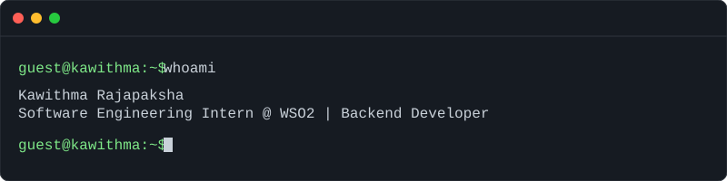

<h1 align="center">Hi 👋, I'm Kawithma Rajapaksha</h1>

<h3 align="center">Software Engineering Intern @ WSO2 | Computer Engineering Undergraduate</h3>

  Backend Engineering • Microservices • AI • DevOps

  
  
  

 

  

 

<h2 align="center">👨‍💻 About Me</h2>

- 💻 **Software Engineering Intern at WSO2** | Specializing in backend development
- 🎓 Computer Engineering Undergraduate at the **University of Ruhuna**
- 🧩 Building real-world applications with **Microservices**, Spring Boot, and Node.js
- 🔐 Deeply interested in **Identity & Access Management (IAM)**, WSO2 IS, and cybersecurity
- ⚙️ Passionate about **DevOps**, configuring automated pipelines using Docker, Jenkins, Terraform, and Ansible
- 🚀 Currently working on **Aegis Mesh** and a **CTF Hosting Platform**
- ⚡ Serving as Junior Treasurer for the IEEE Communications Society Student Chapter (2025/2026)

 

<h2 align="center">🛠️ Tech Stack</h2>

  <!-- Languages -->
  
  
  
  

  <!-- Backend -->
  
  
  

  <!-- DevOps & Tools -->
  
  
  
  

 

<h2 align="center">🚀 Featured Projects</h2>

| Project | Description | Tech Stack |
| :--- | :--- | :--- |
| 🛡️ **Aegis Mesh** | A real-world microservices project focused on scalable backend architecture and distributed systems. | `Microservices` `Backend` |
| 🚩 **CTF Engine** | Collaborative development of a Capture The Flag hosting platform. | `Cybersecurity` `Backend` |
| ⚙️ **DevOps Automation for Diary App** | Built a complete CI/CD pipeline and automated infrastructure provisioning for a web application. | `Docker` `Jenkins` `Terraform` |
| 📚 **Tuition Management System** | Full-stack educational management platform built for scalability and performance. | `React` `Spring Boot` `SQL` |
| 📱 **Meal Planning App** | Mobile recipe and meal planning application. | `Flutter` `SQLite` |

 

<h2 align="center">🏆 Achievements</h2>

- 🏅 **IEEEXtreme 19.0** - Global Rank 655 (Team KOGX)
- 🥈 **DesignHer 1.0 (2025)** - Second Runner-up (IEEE WIE Affinity Group)
- ⭐ **VoltCast 1.0 Ideathon (2024)** - Top 6 Finalist

 

<h2 align="center">📈 GitHub Stats & Journey</h2>

  

  
  

---

  <b>Build • Learn • Improve • Repeat</b>

